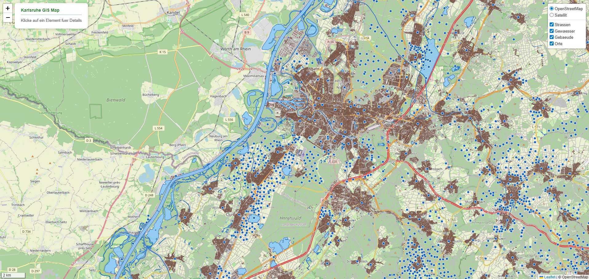

# GeoServer + Leaflet Web Map — Karlsruhe

Interactive web map of the Karlsruhe region built with GeoServer as
the spatial backend and Leaflet.js as the frontend framework.



## Features

- Interactive map centered on Karlsruhe, Germany
- WMS layers served from GeoServer via Docker
- Click popup with feature information (street name, type, speed limit)
- Layer control — toggle layers on/off
- Basemap switcher — OpenStreetMap / Satellite
- Scale bar
- CORS handled via Express proxy server
- Zoom-dependent layer rendering for better performance

## Tech Stack

| Technology                | Purpose                       |
| ------------------------- | ----------------------------- |
| GeoServer 2.24.4          | Spatial data server (WMS/WFS) |
| Leaflet 1.9.4             | Interactive map frontend      |
| Node.js + Express         | Proxy server (CORS handling)  |
| Docker + Docker Compose   | Containerized deployment      |
| OpenStreetMap (Geofabrik) | Source data                   |

## Layers

| Layer     | Type    | Source        |
| --------- | ------- | ------------- |
| Strassen  | Line    | OSM Geofabrik |
| Gewaesser | Polygon | OSM Geofabrik |
| Gebaeude  | Polygon | OSM Geofabrik |
| Orte      | Point   | OSM Geofabrik |

## Project Structure

geoserver-leaflet-map/
├── css/
│ └── style.css # Map styling
├── js/
│ └── map.js # Leaflet map logic
├── data/
│ └── Karlsruhe/ # Shapefiles (not in Git)
├── screenshots/
│ └── map.png # Project screenshot
├── Dockerfile # Node.js app container
├── docker-compose.yml # Multi-container setup
├── init.sh # GeoServer auto-setup script
├── server.js # Express proxy server
├── index.html # Main HTML file
└── README.md

## Quick Start

### Prerequisites

- Docker Desktop installed and running
- Git
- Bash (Git Bash on Windows)

### Step 1 — Clone Repository

```bash
git clone https://github.com/sumon05/geoserver-leaflet-map.git
cd geoserver-leaflet-map
```

### Step 2 — Download Shapefile Data

Go to https://download.geofabrik.de/europe/germany/
Download "Regierungsbezirk Karlsruhe"
Extract ZIP
Copy these files to data/Karlsruhe/:

| File                                        | Description    |
| ------------------------------------------- | -------------- |
| roads_utf8.shp + .dbf .shx .prj             | Street network |
| gis_osm_water_a_free_1.shp + .dbf .shx .prj | Water bodies   |
| buildings_utf8.shp + .dbf .shx .prj         | Buildings      |
| gis_osm_places_free_1.shp + .dbf .shx .prj  | Places         |

### Step 3 — Start Docker

```bash
docker-compose up
```

Wait until both services are ready:
geoserver-1 | Server startup in XXXX ms
app-1 | Server running on http://localhost:3000

### Step 4 — Run Setup Script

Open a second terminal and run:

```bash
bash init.sh
```

This script automatically:

- Creates the `karlsruhe` workspace in GeoServer
- Creates all 4 datastores pointing to the Shapefiles
- Publishes all 4 layers with EPSG:4326
- Assigns styles to each layer

Expected output:
Warte auf GeoServer...
Erstelle Workspace...
Erstelle Stores...
Erstelle Layer...
Setup abgeschlossen!
Karte: http://localhost:3000
GeoServer: http://localhost:8081/geoserver

### Step 5 — Open the Map

http://localhost:3000

## GeoServer Admin Panel

URL: http://localhost:8081/geoserver
Username: admin Password: geoserver

## Architecture

Browser (localhost:3000)
↓
Express Server (server.js) ← CORS Proxy
↓
GeoServer (localhost:8081) ← WMS/WFS
↓
Shapefiles (/opt/shapefiles) ← Geodaten

## Screenshots

### Map with Popup


## Troubleshooting

**Map not loading:**

```bash
# Check if containers are running:
docker ps

# Restart if needed:
docker-compose down
docker-compose up
```

**Layers missing after restart:**

```bash
# Run setup script again:
bash init.sh
```

**Port 8080 already in use:**
Stop local GeoServer before starting Docker

## Data Sources

- OpenStreetMap contributors
- Geofabrik GmbH — https://download.geofabrik.de

## License

OpenStreetMap data licensed under ODbL.
https://www.openstreetmap.org/copyright

## Author

**Shahidul Islam**
GitHub: https://github.com/sumon05
